<p align="center">
  
</p>

<p align="center">
  <b>Turn your media library into scheduled 24/7 live TV channels.</b><br/>
  Your shows, movies and music, playing on a real schedule — with station logos, station breaks,
  "up next" cards and a TV guide — in Plex, Jellyfin, Emby, any IPTV player, or your browser.
</p>

<p align="center">
  <a href="docs/install.md"><b>Install</b></a> ·
  <a href="docs/getting-started.md"><b>Getting started</b></a> ·
  <a href="docs/README.md"><b>Docs</b></a> ·
  <a href="https://www.reddit.com/r/MosaicTV/"><b>r/MosaicTV</b></a> ·
  <a href="CHANGELOG.md"><b>Changelog</b></a>
</p>

<p align="center">
  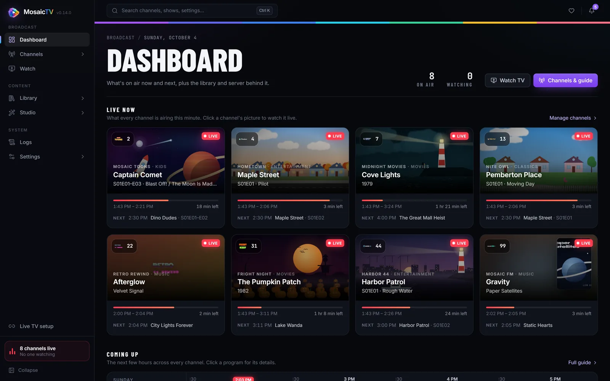
</p>

---

Remember channel surfing? MosaicTV brings it back, but every channel is built
from *your* library. Rebuild Cartoon Network as it was in 2001, Nickelodeon's
1996 lineup with SNICK on Saturday night, a Halloween movie channel for
October, a station that plays your music — then flip to one like real TV: it's
already playing, mid-episode, right on schedule.

The pictures on this page come from a real MosaicTV running those very
channels.

## At a glance

- 📺 **Real live-TV channels** — tune in mid-program like broadcast TV; every channel resumes where it left off, forever.
- 🧩 **Cartoons in the half-hours they aired as** — shorts grouped into broadcast episodes, even with a short borrowed from another show.
- 🗓 **Scheduling that thinks like a station** — a 24/7 rotation, day and time blocks with soft or exact-time starts, five playback orders, and a broadcast clock that starts shows on the :00 and :30. Edit any time: the guide follows from the next program on.
- 🎬 **Broadcast polish** — station logos and watermarks, station breaks with idents made from your logo, commercial breaks at each episode's act breaks, and an "up next" card with the next show's poster.
- 🎵 **Music channels** — songs from your own files over a now-playing screen: the album art, a spectrum drawn from the song, or its lyrics as they're sung.
- 🔍 **A library built in** — a scanner that reads .nfo files, tags, TMDB and TheTVDB, with show pages that know where everything's on.
- 📡 **Works with what you watch on** — M3U + XMLTV for Jellyfin, Emby, VLC, TiviMate and any IPTV app, a built-in HDHomeRun tuner for Plex, and TV mode in the browser.
- ⚡ **One container, GPU or not** — web UI, database and ffmpeg included; NVIDIA, Intel, AMD or Apple encoding verified on your host, with a clean CPU fallback.

## Cartoons, the way they aired

This is why MosaicTV exists. A half-hour of *Dexter's Laboratory* was three
seven-minute cartoons. *2 Stupid Dogs* ran a *Super Secret Secret Squirrel*
short between its two dog cartoons. Your files list each short as its own
episode — and the squirrel as a different show altogether — so most tools air
them as seven-minute slivers, shuffled apart, with the squirrel nowhere near
the dogs.

MosaicTV puts them back together. On any season, **Group broadcast episodes**
folds the segments that aired together into one **broadcast episode**: they
play back to back as a single program, show as one entry in the guide and get
one up-next card naming every part. Every playback order and every "play N"
turn treats it as one program, and a block's end or an exact-time start never
splits it.

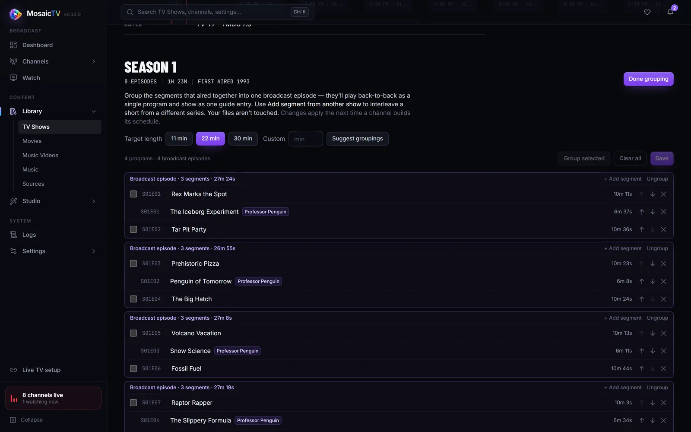

- **Suggest groupings** packs consecutive segments into 11-, 22- or 30-minute
  slots (or a length you choose) as a starting point. Tick, group, reorder or
  ungroup from there.
- **Borrow a segment from another show.** Search the whole library and slot a
  short from a different series into the running order, right where it aired.
  That show's own page then marks which of its episodes air inside another.
- **Nothing on disk changes.** Grouping is metadata only: your files keep their
  names and their real season and episode numbers.

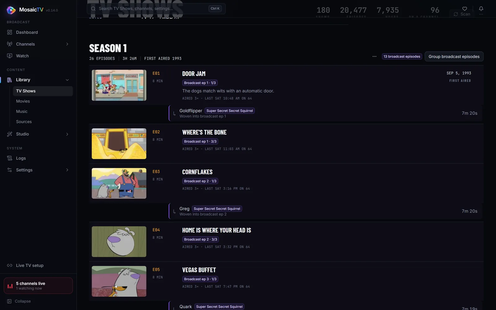

The walkthrough is in
[Channels & Scheduling](docs/channels.md#broadcast-episodes-multi-segment-shows).

## A schedule that runs like a station

The **rotation** is a channel's 24/7 backbone — collections that loop
forever, one or more programs a turn. **Time blocks** take over for set days
and times, on a weekly grid. A **soft** start waits for the current program to
finish; a **hard** start begins on the dot, with a station break covering the
gap. Each block can have its own playback order, logo, breaks and up-next
card.

Here's Nickelodeon in 1996: Nickelodeon by day, Nick at Nite every night, and
SNICK on Saturdays from 8 — a hard start on a half-hour **broadcast clock**,
so *Clarissa*, *Kenan & Kel*, *Ren & Stimpy* and *Are You Afraid of the Dark?*
each start on the :00 or the :30, with a break filling the time between.

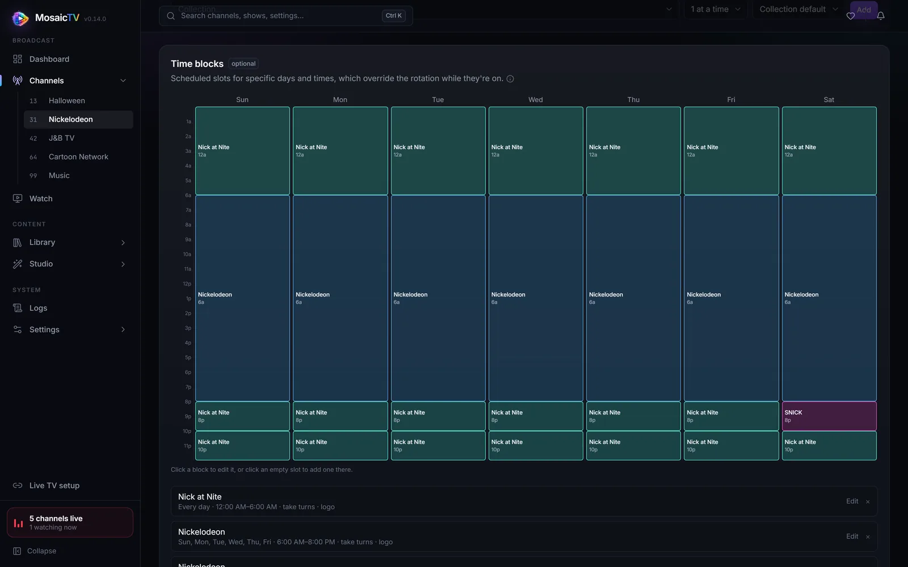

And a Halloween movie channel in seven dayparts — Little Monsters in the
morning, a family matinee, the monster hits, Fright Night after 8 (Freddy on
Fridays, in order), then Midnight Madness and the Graveyard Shift:

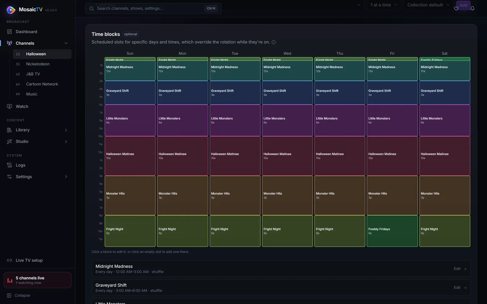

Guides are built ahead and topped up on their own, so listings never run dry —
and there's nothing to rebuild after an edit: the guide changes from the next
program on, and every show carries on from the episode it was up to. The
**Schedule** tab warns you about the traps before they air (a block that will
run into an exact-time start, specials airing first), and the Guide tab shows
**what aired** and lays the schedule out **weeks ahead**.

### Channels built from collections

A channel plays **collections**: whole shows, single seasons, episodes, movies,
artists or albums, plus an optional smart filter (by library, type, title or
genre). Members show as a poster grid you drag into order.

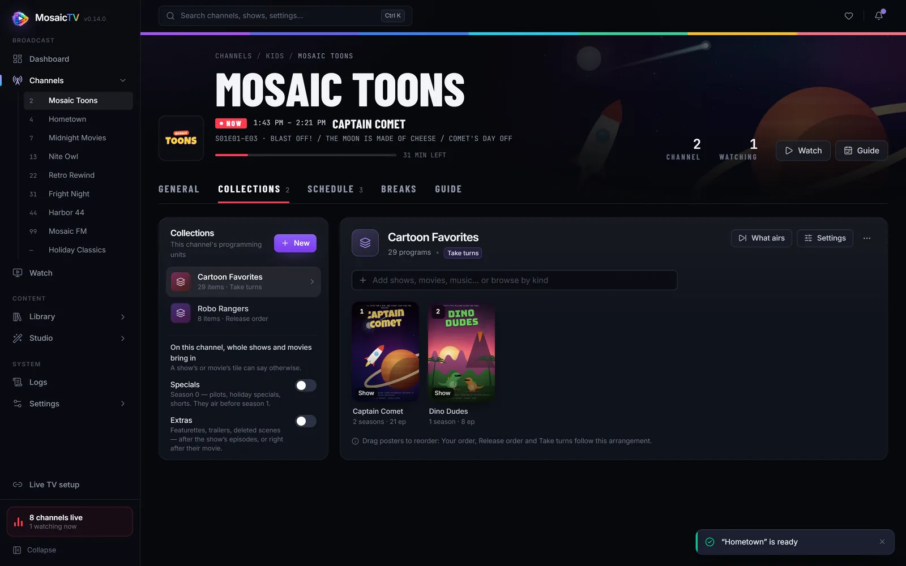

Every collection plays in one of five orders, each described in plain words
with a preview of its first airings:

| Order | What it airs |
| ----- | ------------ |
| **Your order** | Exactly as arranged — each show's full run, or each artist's music, before the next one. |
| **Release order** | Oldest first: movies and music by year, each show's episodes in order. |
| **Take turns** | One episode from each show, or one song from each artist, in turn, in your order. |
| **Take turns, mixed** | Every show or artist gets one turn per round, each round in a new random order. |
| **Shuffle** | Everything at random, nothing repeating until all of it has played — and never the same artist twice running. |

Taking turns, **each show and artist keeps its own place**: add one and it
starts at its first episode while the rest carry on; reorder them and only
whose turn is next changes.

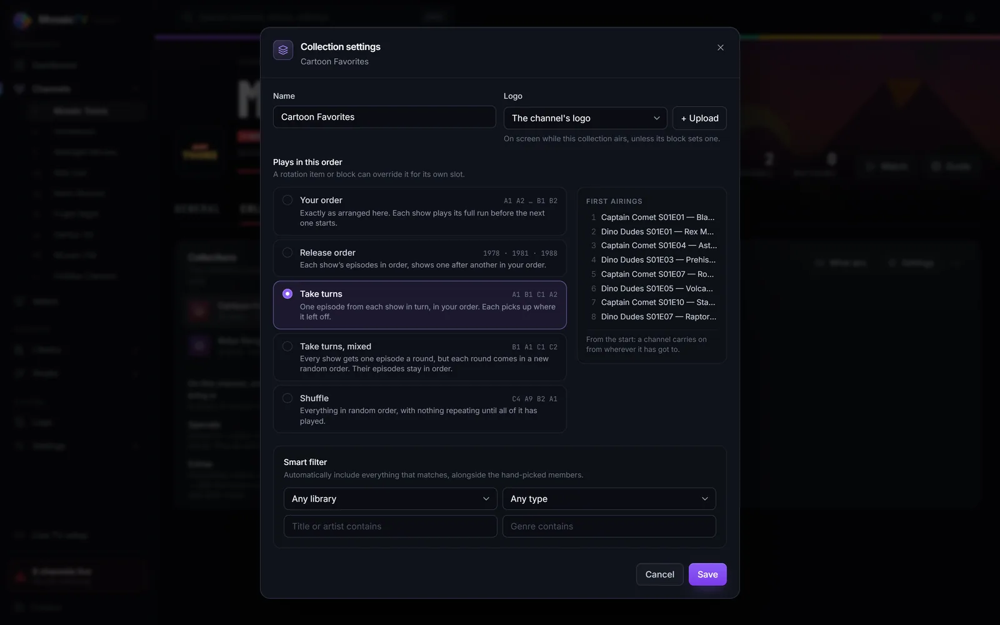

### The guide

The **Channels** page has every channel with the full **TV guide** underneath:
a pinned time ruler, a red now-line, 12/24/48-hour spans and three zoom levels.
It's the same XMLTV your players get.

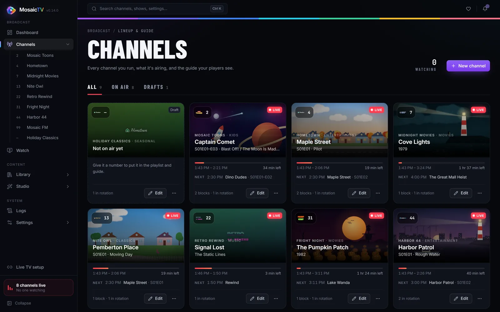

## Station breaks

**Breaks** cover the gaps so blocks end on time, and each channel's **Breaks**
tab is the one place they're set up. A channel's **idents** are what plays,
each made from the logo on the air with an optional music bed:

- **Mosaic** (the default) — your logo on a wall of glass tiles, with rings of
  light spreading out from behind it.
- **Frosted glass** — rows of logos gliding behind frosted glass, out-of-focus
  lights drifting at different depths, your logo floating in front.
- **Your own clip**, or **Clips from a folder** — a break reel of your old
  bumpers, promos and commercials, a fresh mix every break.


An ident plays **everywhere else** or **only during certain blocks** — a Nick
at Nite ident for the Nick at Nite blocks — and where several can play, breaks
take turns. The tab shows when the next break is and what it'll play, which
blocks have breaks, a week map coloured by the ident each block plays, and a
warning when an ident would never air. Play a six-second preview with the real
logo and music before you save.


With **breaks inside programs**, a channel cuts to a break at each episode's
act breaks — found from the file's chapter marks, or from its fades to black
when it has none — and on a broadcast clock, each slot's break time is shared
out across them, the way it aired with commercials.

## "Up next" cards

Near the end of a program, a frosted-glass card slides in naming what's on
next: the poster, the title, the episode and its title, the year, genres and
rating, and the time it starts. A broadcast episode gets one card listing every
segment. On a 4:3 show like *Ren & Stimpy*, the card stays on the picture
instead of out in the black bars.


Pick **Glass** or a cable-style **Broadcast** bar, in any corner or along any
edge (clear of your logo), in three sizes. A live preview in the channel's
settings shows its actual next program.

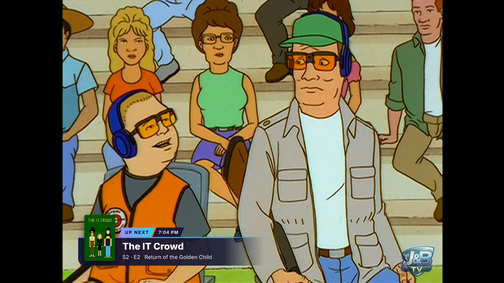

## Music channels

Songs from your own files air over a **now-playing screen**: the album art, a
spectrum drawn from the song, or its lyrics, lit line by line as they're sung —
with what played before and what's next along the bottom. Music is filed by
album artist the way music apps file it, **Take turns** works by artist, and
MusicBrainz, the Cover Art Archive and LRCLIB fill in albums, covers and synced
lyrics, free. Music videos get a matching **Now playing** card. In the guide, a
run of songs reads as one block an hour named after its collection, with the set
list a click away, instead of a sliver per song.

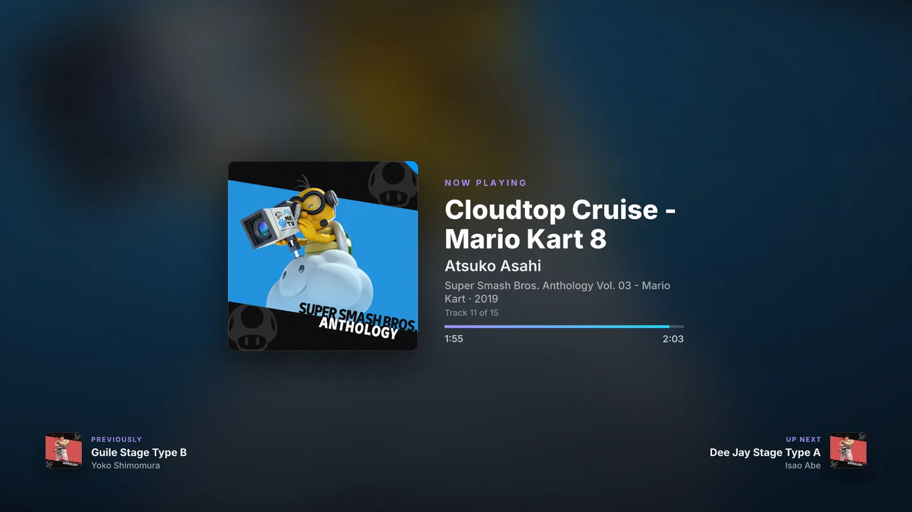

## Your library, with artwork

A Plex-style scanner indexes TV, movies, music videos and music, files each
title's extras under it, and reads metadata the way Plex's agents do — .nfo
files, the files' own tags, TMDB and TheTVDB, in the order you set: posters,
backdrops, summaries, ratings, cast, and every episode's name, air date and
still. Every title's page shows where it's on the air — the channels carrying
it, its next airing and the evening around it — with **Add to a channel**
a click away.

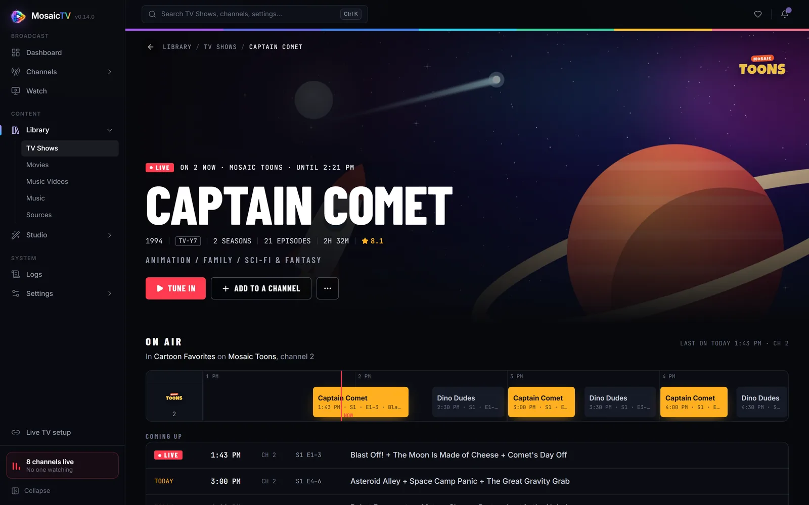

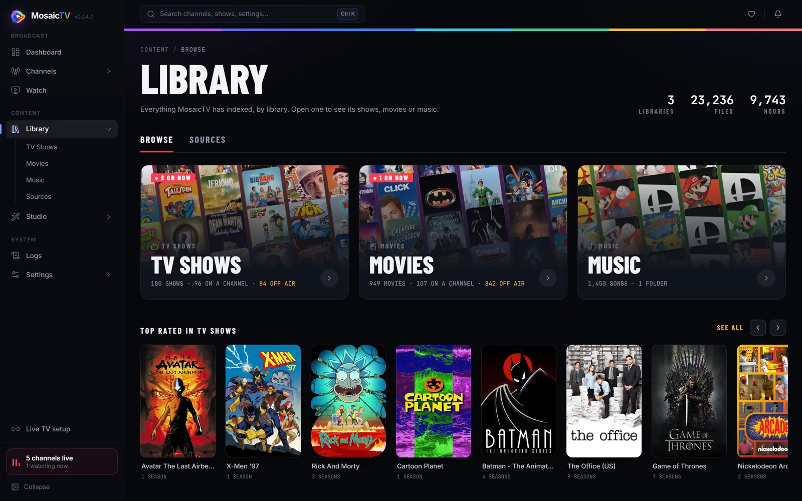

## Studio: logos and watermarks

**Studio** is the branding kit. Upload logos and give each its own
**watermark** — permanent or intermittent with fades, any corner, size and
opacity — previewed live over a frame from your library. Music and clips for
your breaks live here too.

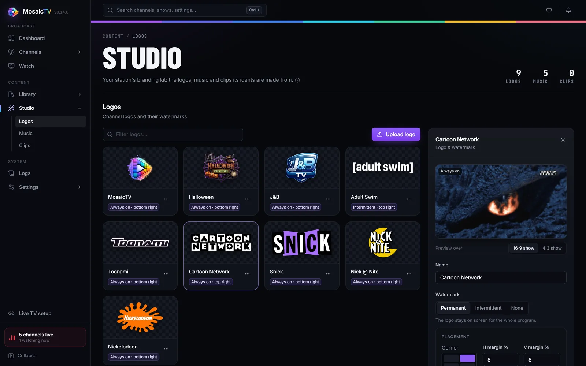

## TV mode

**Watch** turns the browser into a TV: the channels full screen, a banner with
what's on and what's next as you tune in, and a channel guide over the picture.
Flip with **↑ / ↓** or a swipe, type a number to jump straight to a channel,
**⌫** for the last one. Cast to a Chromecast or Google TV (Chrome/Edge, over
HTTPS) or an Apple TV (Safari, AirPlay).

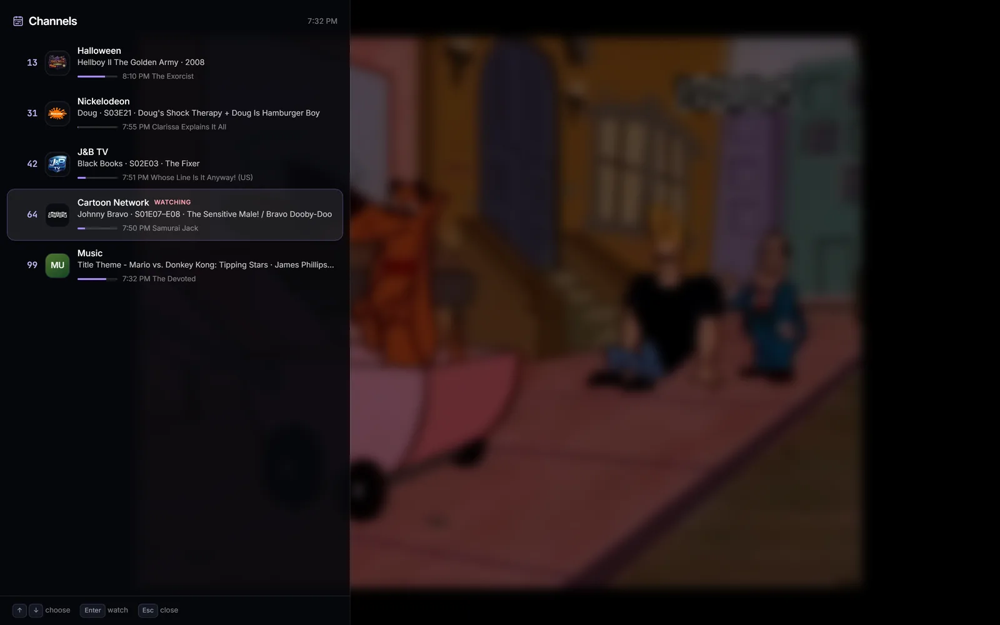

## And the rest

- **Search from anywhere** (Ctrl/⌘ K) — pages, channels, settings, and every
  show, movie and artist in your library.
- **Notifications** — a bell follows ident builds, library scans and metadata
  fetches with live progress, wherever you are in the app.
- **Works on a phone, and on a 4K monitor** — the sidebar becomes a drawer on a
  phone, long-press moves things, and a big monitor gets wider pages and more
  columns.

<table>
  <tr>
    <td width="50%">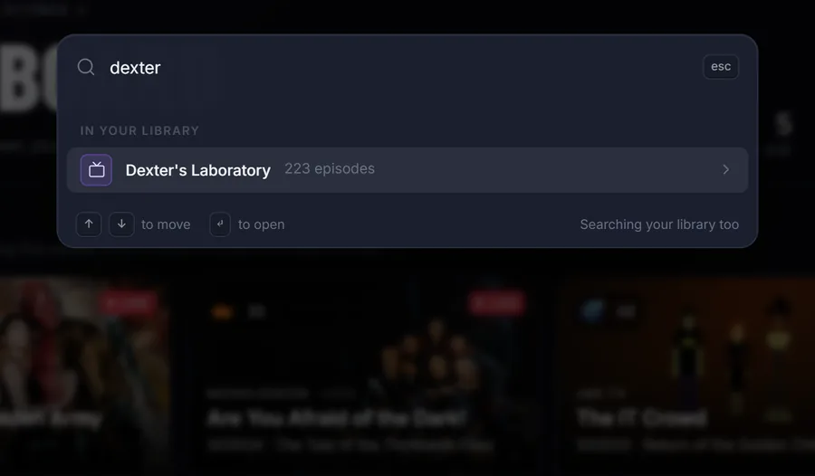</td>
    <td width="25%">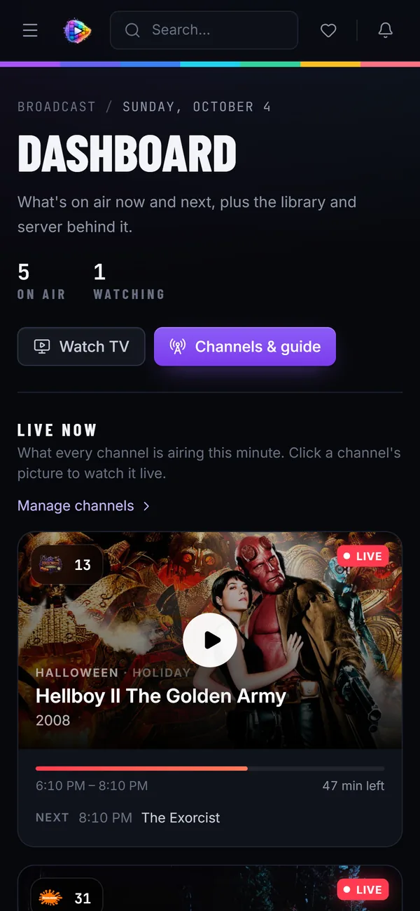</td>
    <td width="25%">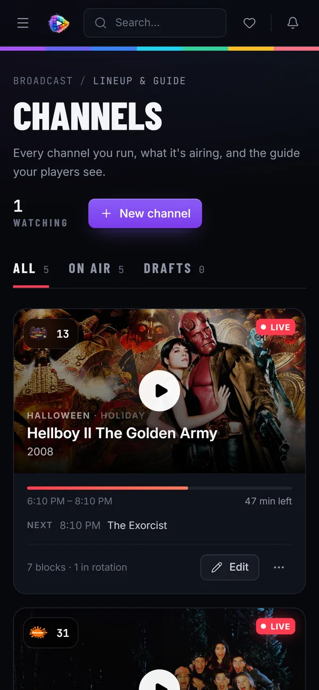</td>
  </tr>
</table>

### Output and encoding

- **Standard M3U + XMLTV**, plus a built-in **HDHomeRun tuner** that Plex's
  Live TV adds directly. **Live TV setup** at the bottom of the sidebar has
  every address with copy buttons and step-by-step instructions per player.
- **Shared HLS** (one transcode per channel, however many viewers) or
  per-client **MPEG-TS** — and only channels someone is watching are encoded.
- **Per-channel encoding profiles** — resolution, fps, bitrate, deinterlacing,
  subtitle burn-in and loudness normalization — and a preferred audio language
  per channel.
- **GPU encoding** on NVIDIA, Intel (QuickSync or VAAPI) or AMD (VAAPI) —
  and AMF or Apple VideoToolbox outside Docker — each verified by a real test
  encode on your host.
- **One-click backup** from Settings, a copy taken before any upgrade changes
  the database, and an in-app log viewer with a download for bug reports.

## Hardware requirements

Only channels someone is watching are encoded, and viewers of the same channel
share one encode — so size the server by how many **different channels are
watched at once**.

| | Light | Recommended | Heavy |
| - | ----- | ----------- | ----- |
| **Channels watched at once** | 1–2 | 3–5 | 6 or more |
| **CPU** | 4 cores, from about 2015 on | 4–6 cores | 6–8 cores |
| **GPU** | None (CPU, 720p) | Intel, AMD or NVIDIA; NVIDIA GTX 1050+ for HEVC files | NVIDIA RTX |
| **RAM** | 4 GB | 8 GB | 16 GB |

Any tier needs a 64-bit Intel or AMD (amd64) Docker host, an SSD with about
10 GB free for app data, and a wired connection. See
[Hardware requirements](docs/hardware-acceleration.md#hardware-requirements)
for what drives the cost, measured numbers and bandwidth per viewer.

## Quick start

```bash
docker run -d \
  --name mosaictv \
  --restart unless-stopped \
  -p 8688:8688 \
  -e TZ=America/Chicago \
  -v /path/to/appdata/mosaictv:/app/data \
  -v /path/to/your/media:/media:ro \
  ghcr.io/tronvondoom/mosaictv:latest
```

Open `http://YOUR-SERVER:8688`, add a library, scan, build a channel — the
[Getting Started guide](docs/getting-started.md) walks you through all of it
in about ten minutes. `:latest` is the newest release; `:edge` follows every
change.

> 🔒 Out of the box MosaicTV has no login, which is right for a home network.
> To watch away from home, use a VPN like Tailscale, or turn on **sign-in**
> (Settings → Sign-in): a password or a code you approve, and links of their
> own for players. See [Security](docs/security.md).

## Documentation

| | |
| - | - |
| 🚀 [Installation](docs/install.md) | Docker run · Portainer · **Unraid template** · Compose |
| 🏁 [Getting Started](docs/getting-started.md) | First library → first channel → first stream |
| 🗓 [Channels & Scheduling](docs/channels.md) | Collections, broadcast episodes, rotations, time blocks, playback orders, the guide |
| 🎨 [Branding](docs/branding.md) | Logos, watermarks, station breaks, up-next cards |
| 📡 [Connecting Players](docs/clients.md) | Jellyfin · Emby · Plex · VLC · IPTV apps · casting |
| ⚡ [Hardware Acceleration](docs/hardware-acceleration.md) | Hardware requirements, CPU vs GPU, setup per platform, profiles |
| 🔒 [Security](docs/security.md) | Sign-in, player links, VPN access, reverse proxies |
| 🛠 [Troubleshooting & Backup](docs/troubleshooting.md) | Common fixes, logs, backup/restore |

## Tech stack

Express + TypeScript backend, React + Vite + Tailwind frontend, Prisma +
SQLite, ffmpeg for everything video. See [CHANGELOG.md](CHANGELOG.md) for
release history.

For local development:

```bash
npm run install:all   # root + server + web dependencies
npm run dev           # backend :8688, frontend :5173
```

## Community

Questions, ideas, and the lineups people have built: come say hi on
[r/MosaicTV](https://www.reddit.com/r/MosaicTV/).

## Contributing

Issues and PRs welcome — bug reports with the in-app log download attached are
extra welcome. If you're missing a feature (another ident look? another
metadata source?), open an issue and let's talk.

## Support

MosaicTV is free and stays free — every feature, for everyone. If it's earned a
spot on your server and you'd like to chip in, you can
[sponsor it on GitHub](https://github.com/sponsors/TronVonDoom) or
[buy it a coffee on Ko-fi](https://ko-fi.com/tronvondoom). The heart and the
cup beside the bell in the app's top bar go to the same places.

### Sponsors

With thanks to the people keeping MosaicTV on the air.

<!-- Who goes here, by tier:
     Station owner ($25/month): avatar + link to their GitHub profile, first.
     Premium channels ($10/month) and Box set ($50 one-time): by name.
     Monthly sponsors stay while they sponsor; one-time Box sets stay for good. -->

## License

[GPL-3.0](LICENSE) — free to use, modify, and share; derivatives stay open.
