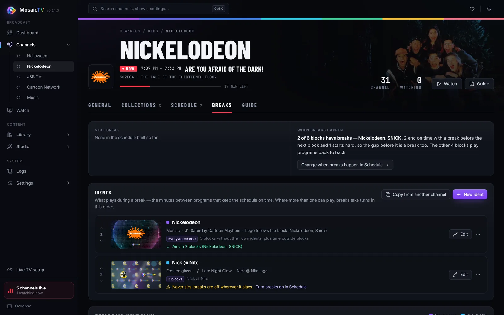
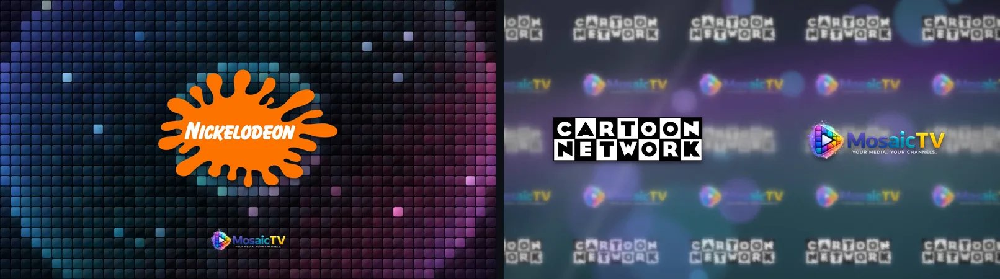
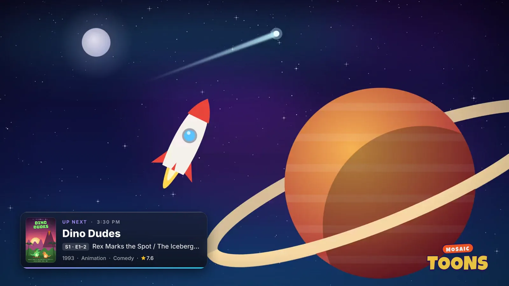

# Branding: Logos, Watermarks & Breaks

The touches that make a channel feel like a real station: an on-screen bug in
the corner, station breaks between programs, and "up next" cards.

## Logos

Upload logos under **Studio → Logos** (PNG with transparency looks best).
Uploaded logos are stored in your data volume and can be assigned to:

- a **channel** (General tab) — used in players' guides (M3U `tvg-logo` +
  XMLTV icon) *and* as the default on-screen watermark;
- a **collection** — on screen while that collection airs;
- a **time block** (Schedule tab) — overrides the on-screen logo while that
  block airs.

Priority on screen: **block logo → collection logo → channel logo**.

The **MosaicTV** logo comes with the app, marked *(default)* in the logo list,
and a new channel starts on it. Pick **No logo** for a channel to have none:
nothing in the corner, no icon in players' guides (they show the channel's
name instead), and idents that would be branded with a logo play the animated
look instead. A collection or block left on **The channel's logo** /
**use collection/channel logo** follows the channel.

Click a logo to open it in the inspector: rename it, replace its image, or give
it its own watermark settings. The preview shows the bug over a frame from your
library, in 16:9 or 4:3, as you change them.

## Watermark behavior

**Settings → Channels → Watermark** sets how the on-screen logo is drawn, for any logo
without watermark settings of its own (with the same live preview):

- **Mode** — `permanent` (always on), `intermittent` (appears every N minutes
  for a set duration, with fade in/out), or `none`.
- **Position** — any corner; margins in percent.
- **Size** — width as a percent of the frame, the same on every program.
  With **Keep the logo on the picture**, it's set in from the corner of the
  picture instead of the frame (so it stays off a 4:3 show's black bars), at
  the same size.
- **Opacity** — see-through like a real station bug.
- **Intermittent timing** — frequency (minutes), on-screen duration (seconds),
  fade time (seconds).

The watermark hides during breaks by default, fading out as a break starts and
back in after. A channel can keep it on screen instead: **Corner logo during
breaks** on its Breaks tab.

## Station breaks

A break is time between programs when the channel airs its idents instead of
a show — the station's answer to the commercial break. The schedule opens one
only where it needs to keep time:

- At the end of a time block, or spread between its programs, so the block
  ends exactly on time (edit a block → **Breaks** → *End*).
- Before a **hard-start** block, so it begins exactly on time (*Start*).
- After each program on a **broadcast clock**, up to the next line — and, with
  **breaks inside programs**, at its act breaks too (see
  [The broadcast clock](channels.md#the-broadcast-clock)).

A channel with none of these never has a break: its programs run back to back.
The block settings are explained in
[Breaks: starting and ending on time](channels.md#breaks-starting-and-ending-on-time).

The stream also shows the channel's breaks whenever it has nothing else to
show, instead of going to black:

- the time between blocks on a blocks-only channel;
- the rest of a slot whose file turned out shorter than its listing;
- a program that can't be played at all (see
  [Troubleshooting](troubleshooting.md#a-program-shows-the-station-ident-instead)).

### The Breaks tab

Each channel's **Breaks** tab is the one place its breaks are set up:

- **Next break** — when it is, what it leads into, which ident it'll play, and
  whether that ident is built yet.
- **When breaks happen** — which blocks have breaks, in words, with a button to
  the Schedule tab to change it. It warns you when a channel's breaks can never
  air.
- **Idents** — what plays during a break (below), in the order breaks take
  turns.
- **Where each ident plays** — the week as a map, each block in the colour of
  the ident its breaks would play, striped where its breaks are off, with a
  white mark at each break. Select a block to see what it does and plays, and
  jump to it on the Schedule tab.
- **Promos** — how often a break ends on a promo for something coming up
  later (below).
- **Corner logo during breaks** — keep the watermark on during this channel's
  breaks.

### Idents

An ident belongs to one channel. Each has:

- a **look** — **Mosaic** (the default), **Frosted glass**, **Your own clip** (a
  video uploaded to **Studio → Clips**), or **Clips from a folder** (a break
  reel, below);
- a **logo** — **Follow the block** (the logo of whichever block is on, so one
  ident is branded correctly in every block) or **Always the same** logo;
- optional **music** from **Studio → Music**;
- where it **plays**: **Everywhere else** (every block without idents of its
  own, time outside blocks, and the gaps before hard starts), or **Only during
  certain blocks**, which takes over from the "everywhere else" idents while
  those blocks are on. Pick blocks one by one or by the logo they air with.

Every channel keeps at least one "everywhere else" ident — a new channel starts
with a Mosaic one made from its logo — so every break has something the
tab lists. Where several idents can play, breaks take turns in the list's
order (move them up and down to change it). The order carries on across a
restart, and a break that's rebuilt (a retry, a restart mid-break) keeps the
ident it had.

An ident whose blocks all have breaks off is marked **Never airs**, with a link
to the Schedule tab.

To reuse an ident elsewhere, **Copy from another channel** (or **Copy to other
channels…** from an ident's ⋯ menu). Each channel gets its own copy, shown with
its own logos and playing everywhere else there — editing one never changes
another. **Duplicate** makes a second copy on the same channel.

### Looks

| Look | What it is |
| ---- | ---------- |
| **Mosaic** | Your logo on a wall of glass tiles, with rings of light spreading out from behind it through the tiles every few seconds. The wall shades through violet, blue, cyan and magenta as the colours drift across it, a few tiles sparkle now and then, and the MosaicTV mark sits small below your logo |
| **Frosted glass** | Rows of logos glide behind frosted glass, still recognisable through the frost, with out-of-focus lights drifting up at different depths. Each logo in the rows keeps room either side, so a wordmark drawn right to its edges still reads as one logo after another. A more heavily frosted band sits behind your logo, which floats in front on a soft shadow, and light plays across the glass as it runs. Under **Advanced**, **Divider between the halves** adds a lit glass seam between your logo and the MosaicTV mark |
| **Your own clip** | A bumper or ident reel you upload, looped for the length of the break |
| **Clips from a folder** | A break reel: a folder of clips on your media share — bumpers, promos, old commercials. Each break plays a fresh mix of them, one after another, and Mosaic, from the logo on the air, covers whatever time they don't fill. The same break always gets the same clips (a restart mid-break carries on), no clip plays twice in one break, and clips play with their own sound. **Look again** picks up clips added to the folder since |

**Advanced** also has the logo's size. The picture is always built at the
channel's own size.

Earlier builds also offered `logowall`, `pulse`, `animated`, `retro` and
`vintage`. Idents on a retired look keep playing and stay editable; new ones
can't pick it. (`animated` is also the internal fallback whenever a branded
clip can't be built.) **Spotlight** was replaced by Mosaic: an ident that had
it became a Mosaic one on upgrading.

The **music** isn't part of the clip: it's laid over the break as it airs,
starting at the top of every break and playing straight through, looping if
the break outlasts the song. Every break's sound fades in over half a second
and out over the last second and a half. Without music, the look's own soft
tone plays. Changing the music never rebuilds a clip.

A generated clip is a **seamless loop** — every moving part comes back to where
it started by the end, so a long break shows no jump where the clip repeats.
Mosaic loops every 30 seconds; frosted glass every two minutes or so, the
time its slowest lights take to rise back round.

### Preview

**Play preview** in the editor renders the first six seconds of the ident as it
airs — the real look, logo and music — in a few seconds, without saving. When
an ident shows different logos in different blocks, **Show with** picks which.

### Built ahead

A generated look composites *the logo on air where the break falls*, so one
ident becomes a separate clip for every logo it airs with. MosaicTV builds all
of them ahead, in the background and at low priority so live channels come
first: at startup, and whenever an ident is edited, a channel's or block's
logo or profile changes, or a logo image is replaced. The Breaks tab marks an
ident **Building** until it's done, and the notification bell follows each
build. A break never waits on one — if its clip isn't ready yet (say, moments
after an edit), another of the channel's built idents stands in under its
music until it is. Clips nothing airs any more (an old look, a replaced logo)
are deleted automatically.

A break is looped and trimmed to exactly fill each gap, so blocks always land
on their boundaries. "Up next" cards never show over a break.

### Promos

A break can end on a **promo** for something later on the channel, the way a
station filled its breaks with its own programs: twelve seconds of the
program's backdrop and poster, when it's on — *Tonight at 8*, *Tomorrow at
9 AM*, *Saturday night at 10* — and what it is, fading in and out over the
break's music. Set how often on the Breaks tab: **every break**, **1 in 2**,
**1 in 3** or **1 in 5** (off by default). The tab shows the promo a break
would end on now, drawn the way it airs, and the next break says when it ends
on one.

A promo is picked from the guide as its break airs, so a schedule change
changes it, the same as the up-next card. It looks at what starts between
twenty minutes after the break (what's on next is the up-next card's) and a
day ahead, and favours a **movie**, a **block starting** (promoted by the
block's name: *Toonami, starting with Dragon Ball Z*), a **broadcast episode**
named whole, a **season premiere** and **prime time**; each break picks among
the best few, so they take turns, and each thing is promoted at its soonest
airing. A song on its own isn't promoted; a block of them starting is.

Breaks shorter than twenty seconds keep their ident, and so do breaks playing a
reel (which brings its own promos). Promos are drawn ahead, at low priority,
while their programs are on; one that isn't drawn yet when its break comes
leaves the ident to play the break out.

### Upgrading from the filler library

Before 0.12, fillers were a shared library in the Studio, assigned to channels
and blocks, with a default station ident for channels that had none. On
upgrade, each becomes an ident on the channel it aired on — one copy per
channel if it was shared — and a channel that relied on the default station
ident gets its own copy of it (or, with none set, a starter ident: the same
frosted glass it aired before). A filler that wasn't on any channel goes to the
channel whose logo it was branded with, playing during the blocks that use that
logo; one with no match is kept on your first channel, playing nowhere until
you choose. The Studio's stored preview clips are removed — previews render on
demand now — and **Show on filler** moves from the watermark settings to each
channel's Breaks tab.

## "Up next" cards

Near the end of a program, a card slides in naming what's on next: the next
program's poster, its title, the episode (`S1 · E4`) and episode title, and
its year, genres and rating, under an **UP NEXT** label with the time it
starts. A movie shows its runtime instead of an episode.

There are two styles:

- **Glass** — a frosted panel: the picture behind it is blurred, so it reads on
  a bright cartoon as well as a dark film.
- **Broadcast** — a cable-network bar: the poster stands up out of a dark bar,
  an angled **UP NEXT** tab and the time sit on its top edge, and the bar fades
  out toward the middle of the picture. On the right-hand side it's mirrored.

- **Channel-wide**: General tab → Coming up next.
- **Per block**: Schedule tab → edit a block → override (including turning it
  off for that block only).

The settings show a preview: the card your channel's next program would get,
drawn exactly as it airs, over a still from what's on now, with your channel's
logo where its watermark sits — so you can see at a glance if the card would
cover it. It follows your changes before you save.

Cards appear over programs from both rotation and blocks, never over a break.
A station break between two programs doesn't hide the card: it names the
program after the break.

**Broadcast episodes.** A multi-segment episode (Dexter's three shorts, say)
gets one card, timed against the whole episode, not one per segment. The card
announcing it lists every segment, e.g. `S1 · E4–6` and "Dexter Dodgeball /
Dial M for Monkey - Rasslor / Dexter's Assistant", and the card at its end
names the program after it.

**Long titles** are cut at a word with an ellipsis rather than running across
the screen, and a leading episode code the filename left on an episode title
("E03 - …") is dropped, since the card shows the code on its own.

**Timing.** *Before it ends* shows it once, the lead time before the program
ends (default 5 minutes, 12 seconds on screen); *Middle* once at the halfway
point; *Both* does both. On a movie channel the 5-minute mark usually lands in
the end credits, which is where broadcasters put theirs too. **Slide in** is
how long the entrance (and exit) takes; 0 pops it on and off.

**Position.** Eight spots around the picture: the four corners, the middle of
the top and bottom edges, and the middle of the left and right sides. Pick one
clear of your logo — if the watermark sits bottom-left, put the card
bottom-right. It slides in from its nearest edge (from the side, or up from
the bottom / down from the top for the middle positions). The card sits on the
picture itself, so on a 4:3 show pillarboxed into a 16:9 channel it stays on
the image, not out on the black bars. Three sizes.

**Saving applies it to what's on air.** The card and the logo are burned in
when a program starts, so on save the channel re-encodes the current program
from where it is — a viewer skips a couple of seconds, the same as at any
program change. Other edits (name, group, schedule) never interrupt the stream.

### "Now playing" on music videos

A music video gets the same card for its first dozen seconds, headed **NOW
PLAYING**: the song, the artist and album, the year, and the album art when
the library has some. It uses the channel's card style, position and size.
